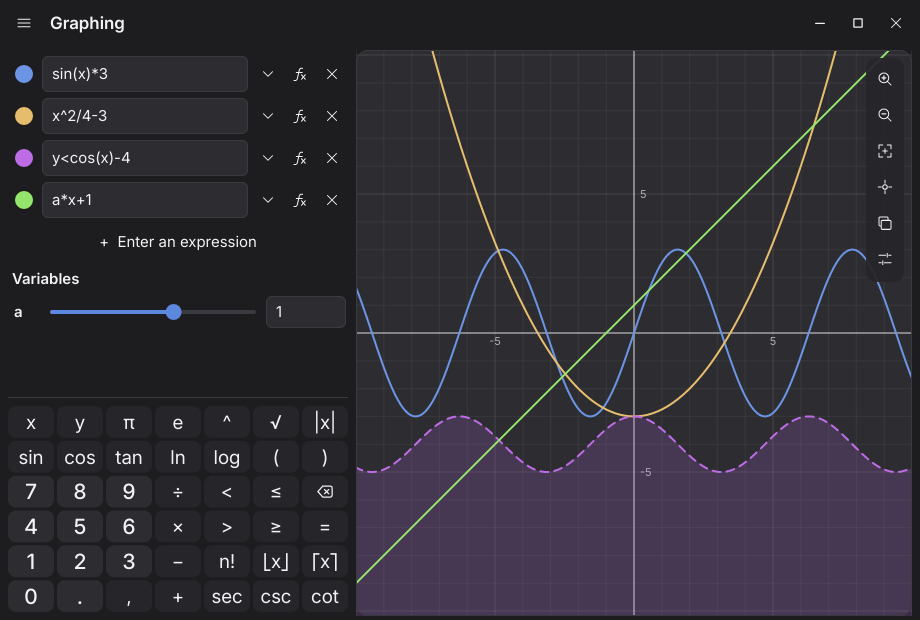
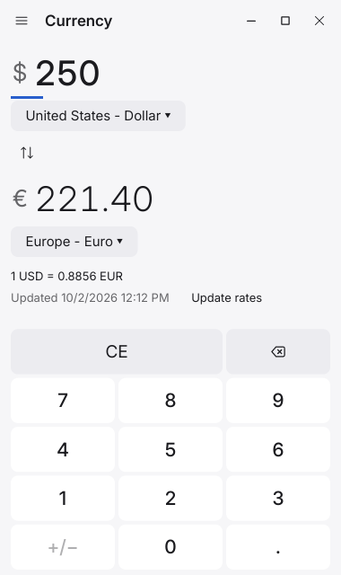
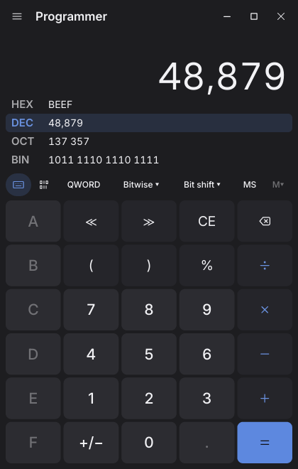

# GMNB & DGMNB

The open-source **Windows Calculator**, ported to Rust — twice.

- **GMNB — GlazeMyNumbers,Baby** looksmaxes: a GTK 4 / libadwaita interface
  that is considerably more beautiful than a calculator has any reason to be.
- **DGMNB — Don't Glaze My Numbers, Baby** resourcemaxes: the same calculator
  drawn in software with a plain interface, in about 13 MB of memory, doing
  nothing at all while it waits.

Both have every mode of the original: Standard, Scientific, Programmer,
Graphing, Date calculation, and thirteen converters (including live
currency), plus history, memory, keep-on-top, copy/paste and the full
keyboard map. The arithmetic is not a re-imagining: the original
arbitrary-precision engine (`Ratpack` + `CalcManager`) was ported
function-for-function and is checked against the real C++ engine.

> Not affiliated with or endorsed by Microsoft. Based on
> [microsoft/calculator](https://github.com/microsoft/calculator) (MIT).

## GMNB: pointlessly beautiful

<p align="center">
  
  
</p>
<p align="center">
  
  
  
  
</p>

## DGMNB: don't glaze my numbers

<p align="center">
  
  
</p>
<p align="center">
  
  
</p>

Light or dark (following your desktop), your desktop's accent colour if it
shares one (kept readable), no GPU, no animations, no idle CPU.

## Memory

| App (760×700, idle) | RSS | PSS | Idle CPU |
| --- | --- | --- | --- |
| GMNB, default (Vulkan) | 205 MB | 121 MB | 0.3% |
| GMNB, software renderer (`GSK_RENDERER=cairo`) | 68 MB | 40 MB | 0% |
| **DGMNB** | **12.6 MB** | **8.6 MB** | **0%** |
| DGMNB, Graphing with three equations | 13.7 MB | 9.5 MB | 0% |
| *KCalc 26.08.1, for reference (Qt 6)* | *79 MB* | *36 MB* | |

DGMNB's toolkit was picked by measuring a bare window with keys in each
candidate: winit + softbuffer + tiny-skia 9 MB, iced (tiny-skia) 14 MB,
Slint (software) 21 MB, GTK 4 without libadwaita 50 MB. DGMNB draws
straight into the compositor's shared-memory buffer and only redraws when
something changes. Its figure includes AccessKit's screen-reader bridge
(idle when no screen reader is running), the Wayland clipboard, and live
desktop colours.

GMNB renders on the GPU so the aurora, blur and glow stay cheap on the CPU;
nearly all of its extra memory is the GPU driver (here NVIDIA's Vulkan
stack) loaded into the process. To trade animation smoothness for memory:

```sh
flatpak override --user --env=GSK_RENDERER=cairo io.github.Go08er.GlazeMyNumbersBaby
# or, for one run / native installs:
GSK_RENDERER=cairo gmnb
```

Measured on NixOS with an RTX 3070 (driver 595), in a headless Wayland
session (weston) at 760×700, idle in Standard mode unless noted. RSS counts
shared libraries in full; PSS splits them between the processes using them.
Numbers will differ with other GPUs, drivers and fonts.

## Install

Every release attaches all of these to its
[GitHub release](https://github.com/Go08er/GlazeMyNumbersBaby/releases).

| Platform | GMNB | DGMNB |
| --- | --- | --- |
| **Flatpak** (any distro) | `flatpak install --user GMNB.flatpak` (GNOME 51 runtime) | `flatpak install --user DGMNB.flatpak` (freedesktop 26.08 runtime) |
| **Arch Linux** | `sudo pacman -U gmnb-*.pkg.tar.zst` | `sudo pacman -U dgmnb-*.pkg.tar.zst` |
| **Debian 13+ / Ubuntu** | `sudo apt install ./gmnb_*_amd64.deb` | `sudo apt install ./dgmnb_*_amd64.deb` |
| **Fedora** | `sudo dnf install ./gmnb-*.rpm` | `sudo dnf install ./dgmnb-*.rpm` |
| **NixOS / Nix** | `nix run github:Go08er/GlazeMyNumbersBaby` | `nix run github:Go08er/GlazeMyNumbersBaby#dgmnb` |

The Arch `PKGBUILD` is a split package that builds both
(`makepkg -si` in `packaging/arch`).

### NixOS module

```nix
{
  inputs.nixpkgs.url = "github:NixOS/nixpkgs/nixos-unstable";
  inputs.gmnb.url = "github:Go08er/GlazeMyNumbersBaby";

  outputs = { nixpkgs, gmnb, ... }: {
    nixosConfigurations.myhost = nixpkgs.lib.nixosSystem {
      system = "x86_64-linux";
      modules = [
        ./configuration.nix # your existing configuration
        gmnb.nixosModules.default
        {
          programs.gmnb.enable = true;  # the glazed twin
          programs.dgmnb.enable = true; # the lean twin
        }
      ];
    };
  };
}
```

In an existing flake, add the input and the two module lines to your host.
There's also `gmnb.overlays.default` (adds `pkgs.gmnb` and `pkgs.dgmnb`) and
`gmnb.packages.<system>.{gmnb,dgmnb}` for Home Manager or
`environment.systemPackages`.

## Building from source

Everything goes through the flake; you don't need Rust installed.

| What | Command |
| --- | --- |
| Dev shell (cargo, rustc, clippy, rust-analyzer, GTK, Wayland) | `nix develop` |
| Run from source | `nix develop -c cargo run -p gmnb` / `-p dgmnb` |
| Native Nix packages | `nix build .#gmnb .#dgmnb`, or `nix run .#dgmnb` |
| **Flatpak bundles** | `nix run .#flatpak` → `dist/GMNB.flatpak`, `nix run .#flatpak-dgmnb` → `dist/DGMNB.flatpak` |
| Flatpak bundle + install | `nix run .#flatpak -- --install` (same for `flatpak-dgmnb`) |
| Refresh `cargo-sources.json` after changing dependencies | `nix run .#update-cargo-sources` |

Without Nix: Rust ≥ 1.92, then

- GMNB: GTK ≥ 4.18, libadwaita ≥ 1.7 and Pango ≥ 1.56, and
  `cargo build --release -p gmnb`;
- DGMNB: libwayland-client (and libxkbcommon at run time), and
  `cargo build --profile lean -p dgmnb`. The `lean` profile optimises for
  size, since DGMNB's own code is most of its memory, but keeps the number
  crunchers at full speed.

> Flakes only see files git knows about. After adding files, `git add -A`
> (staging is enough); the Flatpak scripts refuse to build if they find
> untracked files.

### Packaging layout

```
packaging/
  io.github.Go08er.GlazeMyNumbersBaby.{desktop,metainfo.xml}       GMNB
  io.github.Go08er.DontGlazeMyNumbersBaby.{desktop,metainfo.xml}   DGMNB
  icons/
  flatpak/   canonical manifests (Flathub-style: git tag + cargo-sources.json)
  arch/      split PKGBUILD (gmnb + dgmnb)
  debian/    copy to ./debian, then dpkg-buildpackage -b (needs rustup's cargo)
  fedora/    gmnb.spec (+ the dgmnb subpackage)
nix/         package.nix, dgmnb.nix, NixOS module, Flatpak tooling
```

`nix run .#flatpak` reuses the canonical Flatpak manifest verbatim, only
swapping its source for an offline tarball with every crate vendored by Nix.
The `Packages` workflow builds the Flatpak, Arch, Debian and Fedora packages
in their real distro containers and attaches them to the release.

## Layout

```
crates/ratpack      Ratpack + Number/Rational/RationalMath (arbitrary precision)
crates/calcmanager  CEngine + CalculatorManager + history + expression commands
crates/calcvm       StandardCalculatorViewModel & friends (UI-agnostic)
crates/unitconv     UnitConverter engine, unit tables, currency, view model
crates/datecalc     DateCalculator + its view model
crates/copypaste    CopyPasteManager (paste validation → key sequences)
crates/graphing     Numeric graphing engine (parser, sampler, analysis)
crates/appcore      Everything the twins share that isn't drawing: modes, key
                    layouts and the keyboard map, settings, colour maths,
                    graph sessions, a tiny D-Bus client, time zone fix
apps/gmnb           The GTK 4 / libadwaita application
apps/dgmnb          The software-drawn application (winit, softbuffer,
                    tiny-skia, swash, AccessKit)
tools/oracle/       C++ drivers that generate the golden test data
tools/fonts/        How DGMNB's embedded font subsets are made
```

## Verification

`nix develop -c cargo test --workspace` runs **589 tests** (counts include
doctests; one more, a live currency fetch, is `#[ignore]`d). The heart of it
is differential testing against the *real* C++ engine, compiled from the
upstream sources with g++:

| Crate | What's checked |
| --- | --- |
| ratpack (11) | 13,628 golden cases from the C++ Ratpack (every op and function, all angle types, radixes 2–36, formats, precisions, error codes), byte-for-byte; port of `RationalTest.cpp` |
| calcmanager (77) | 3,500 golden command sequences replayed against the C++ `CalculatorManager` (every display callback, expression token, history and memory state); ports of `CalcEngineTests`, `CalcInputTest`, `CalculatorManagerTest` |
| calcvm (121) | Ports of `StandardCalculatorViewModelTests`, `HistoryTests`, the snapshot tests, plus programmer/paste/event coverage |
| unitconv (138 + 1 ignored) | Ports of `UnitConverterTest.cpp`, `UnitConverterViewModelTests`, currency tests, a known value for every unit, network-policy cases |
| datecalc (40), copypaste (40) | Ports of `DateCalculatorTests` and `CopyPasteManagerTests`, plus paste key-sequence tests |
| graphing (119) | Parser, sampling and asymptotes, implicit/inequality plots, function analysis, frame-time budgets, and regressions for hostile input (deep nesting, huge nCr/nPr, extreme ranges, runaway analysis) |
| appcore (27) | Keyboard map, key scripts, settings storage (huge/corrupt files), colour contrast, saved-equation sanitising, D-Bus wire format |
| gmnb (3), dgmnb (13) | GDK key translation, palette contrast for extreme accents; DGMNB text shaping and font coverage, SVG icons, text editing, accessibility tree soundness |

The oracles live in `tools/oracle/` and need the upstream repository checked
out at `reference/calculator` to regenerate the golden files.

## Deliberate differences from the original

- **Currency rates are real.** Microsoft's endpoints are dead, so the
  open-source app ships fictional planet currencies. Both twins fetch
  central-bank reference rates (158 currencies) via the keyless
  [Frankfurter](https://frankfurter.dev) API, cache them, and fall back to
  a bundled snapshot when offline.
- **Graphing uses a new numeric engine.** The original graphing engine is
  proprietary (open-source builds contain only a mock). This engine was
  written against the original's interfaces and reproduces its features
  numerically: explicit, implicit and inequality plots, variables with
  sliders, tracing, and key-graph-feature analysis.
- **Keep on top** switches to the original's compact overlay, but Wayland
  has no client-side "always on top": pin it with your compositor (e.g. a
  niri window rule for the app ID).
- Dates use the Gregorian calendar; strings are en-US.
- The port fixes a handful of upstream bugs and undefined behaviour (e.g.
  deleting a history item removed the wrong entry; C left the engine in
  E-notation); each is commented at the fix.

## Notes

- **Flatpak on NixOS:** Flatpak can't translate NixOS's `/etc/localtime`
  and runs sandboxes in UTC. Both twins ask systemd-timedated for the real
  zone (read-only `org.freedesktop.timedate1` access), so "Updated …" times
  and Date's "today" are local.
- NVIDIA's driver busy-waits on GPU fences by default, which costs ~20% of a
  core even for gentle animation; GMNB sets `__GL_YIELD=USLEEP` for its own
  process unless you've set it yourself. DGMNB doesn't touch the GPU.

## Licences

The code is MIT; see [LICENSE](LICENSE), which carries Microsoft's original
notice. GMNB embeds the *Outfit* typeface (`apps/gmnb/assets/fonts/`), DGMNB
subsets of *Inter* and *Noto Sans* (`apps/dgmnb/assets/fonts/`), all under
the SIL Open Font License. Exchange-rate data comes from Frankfurter
(central bank reference rates).
